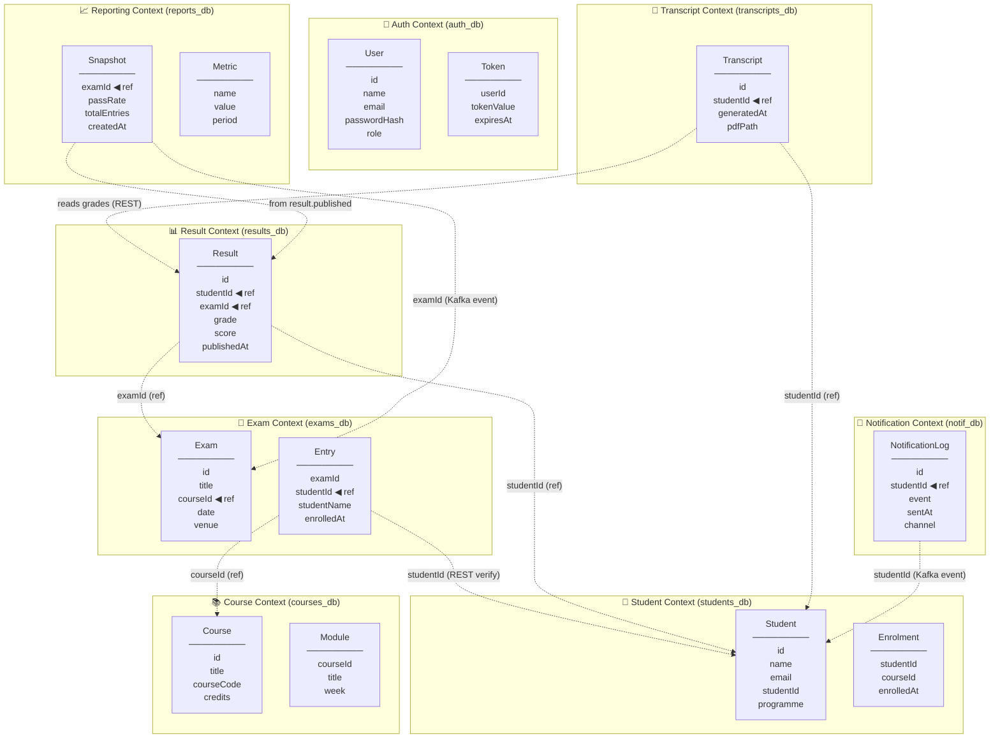

# Bounded Context Diagram — Bounded Context Diagram

> Paste the code block below into [draw.io](https://app.diagrams.net) → Extras → Edit Diagram,
> or open in VS Code with the **Markdown Preview Mermaid Support** extension.

---

## How to render

| Tool | Steps |
|------|-------|
| **draw.io** (recommended) | Go to [app.diagrams.net](https://app.diagrams.net) → Extras → Edit Diagram → paste the Mermaid code block |
| **VS Code** | Install *Markdown Preview Mermaid Support* extension → open this file → Ctrl+Shift+V |
| **Mermaid Live** | Go to [mermaid.live](https://mermaid.live) → paste the code block contents |

Export as **PNG or SVG** from draw.io and insert into your final Word submission.

---

## Cross-Boundary Reference Key

| Arrow | Meaning |
|-------|---------|
| Solid `-->` | Owned relationship (within the same context) |
| Dashed `-.->` | Cross-context reference — passes only the **ID**, never a direct DB join |
| `REST verify` | Synchronous HTTP call to confirm the entity exists at enrolment time |
| `Kafka event` | Asynchronous event — ID is carried in the event payload |
