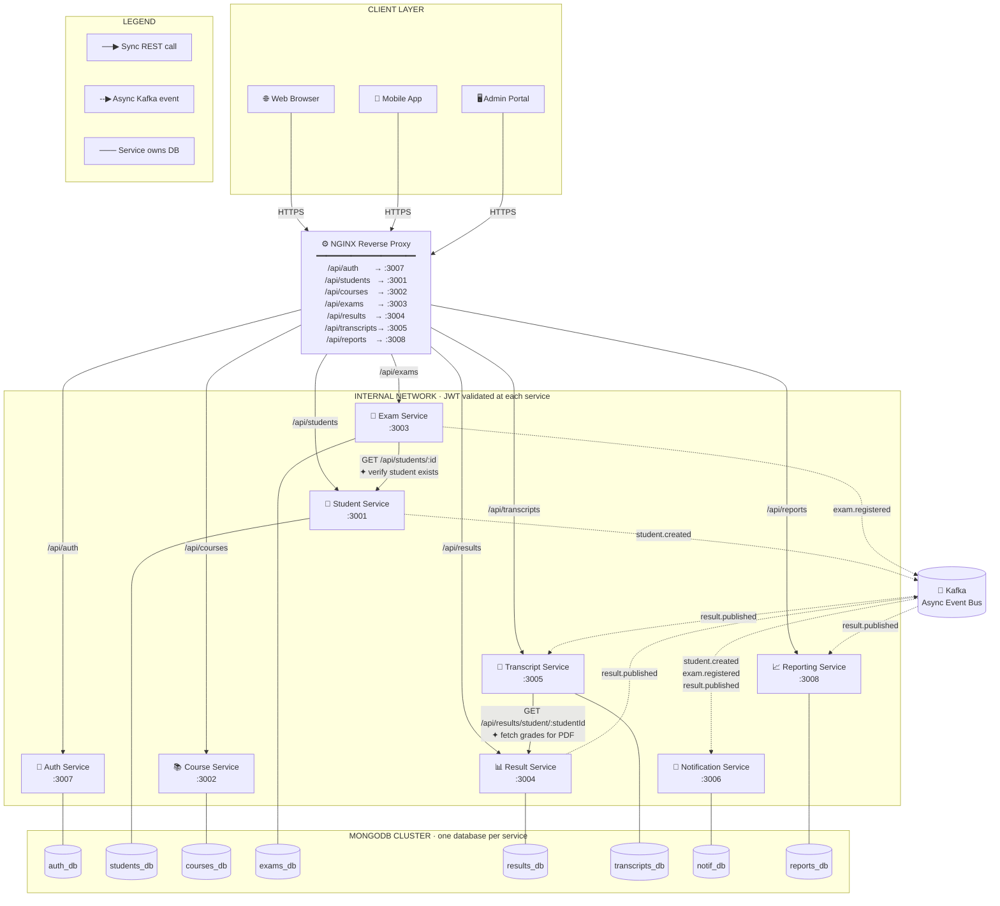

# Service Communication Diagram — Service Communication Diagram

> Paste the code block below into [mermaid.live](https://mermaid.live) or
> VS Code with **Markdown Preview Mermaid Support** to render.  
> Export as PNG/SVG and insert into your Word submission.

---

## Communication Key

| Arrow style | Protocol | Direction | Example |
|-------------|----------|-----------|---------|
| Solid `-->` | Synchronous REST (HTTP/JSON) | Request → Response (blocking) | Exam → Student verify |
| Dashed `-.->` | Asynchronous Kafka event | Fire and forget | `result.published` |
| Plain `---` | Database ownership | Service reads/writes only its own DB | Student → students_db |

---

## Synchronous Flows (REST)

| # | From | To | Endpoint | Trigger | Error handling |
|---|------|----|----------|---------|----------------|
| 1 | NGINX | Any service | `/api/<resource>` | Client HTTP request | 404 if path unknown |
| 2 | Exam Service | Student Service | `GET /api/students/:id` | `POST /api/exams/:id/entries` | 404 if student missing → 404 to client; service down → 502 |
| 3 | Transcript Service | Result Service | `GET /api/results/student/:id` | `POST /api/transcripts/:id/generate` | Service down → 502 |

---

## Asynchronous Flows (Kafka)

| # | Event | Producer | Consumer(s) | Payload |
|---|-------|----------|-------------|---------|
| 1 | `student.created` | Student Service | Notification Service | `{ studentId, name, email }` |
| 2 | `exam.registered` | Exam Service | Notification Service | `{ studentId, examId, examTitle }` |
| 3 | `result.published` | Result Service | Notification Svc, Reporting Svc, Transcript Svc | `{ studentId, examId, grade, score }` |
