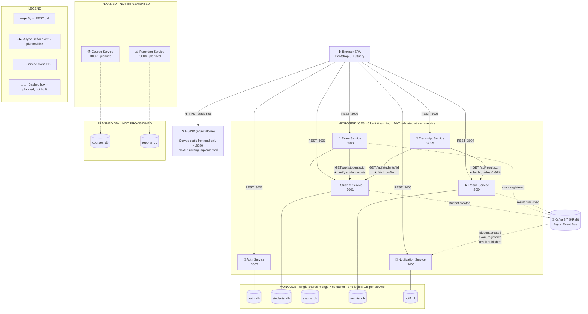

# Service Communication Diagram — Service Communication Diagram

> Paste the code block below into [mermaid.live](https://mermaid.live) or
> VS Code with **Markdown Preview Mermaid Support** to render.  
> Export as PNG/SVG and insert into your Word submission.
>
> **Revision note:** redrawn to match the as-built system — 6 services in solid
> boxes (Auth, Student, Exam, Result, Transcript, Notification), Course and
> Reporting Services shown dashed/grey as designed-but-not-built, NGINX shown
> serving only the static frontend (no path-based API routing exists), and the
> browser calling each service port directly. MongoDB is one shared container
> hosting six logical databases, not a multi-node cluster.

---

## Communication Key

| Arrow / box style | Meaning |
|---|---|
| Solid `-->` | Synchronous REST (HTTP/JSON), request → response (blocking) |
| Dashed `-.->` | Asynchronous Kafka event, or a planned (not-built) link |
| Plain `---` | Database ownership — service reads/writes only its own DB |
| Dashed grey box | Designed but not implemented (Course Service, Reporting Service, their DBs) |

---

## Synchronous Flows (REST) — As Built

| # | From | To | Endpoint | Trigger | Error handling |
|---|------|----|----------|---------|----------------|
| 1 | Browser SPA | Each of the 6 built services, directly | `http://localhost:<port>/api/...` | Any user action in the frontend | Service-specific; no shared gateway error handling exists |
| 2 | Exam Service | Student Service | `GET /api/students/:id` | `POST /api/exams/:id/entries` | 404 if student missing → 404 to client; service down → 502 |
| 3 | Transcript Service | Student Service | `GET /api/students/:id` | `GET /api/transcripts/:studentId/semester/:sem` or `.../final` | Service down → 502 |
| 4 | Transcript Service | Result Service | `GET /api/results?...` and `GET /api/results/gpa/:studentId` | Same as above | Service down → 502 |

**Note:** there is no path-based API gateway in the current build. `nginx.conf` only serves the static frontend (`try_files` + JS/CSS caching); the frontend calls each service's exposed port directly (`http://localhost:3001`, `:3003`, etc.). Row 1 of the original design (NGINX routing every `/api/<resource>` request) describes an unbuilt goal, not the running system — see Architecture Design Document §8 for the full correction.

---

## Asynchronous Flows (Kafka) — As Built

| # | Event | Producer | Consumer(s) | Trigger | Payload |
|---|-------|----------|-------------|---------|---------|
| 1 | `student.created` | Student Service | Notification Service | Successful `POST /api/students` | `{ studentId, name, email }` (approximate — see producer code) |
| 2 | `exam.registered` | Exam Service | Notification Service | Successful `POST /api/exams/:id/entries` | `{ studentId, examId, ... }` |
| 3 | `result.published` | Result Service | Notification Service | `PATCH /api/results/gpa/:gpaId/finalize` | `{ studentId, studentRegNo, academicYear, gpa, status: "final" }` |

**Note:** only Notification Service consumes these topics in the built system. Reporting Service and Transcript Service are **not** Kafka consumers — Reporting Service doesn't exist, and Transcript Service fetches data synchronously via REST on demand instead of maintaining a Kafka-fed local cache. A built Reporting Service would be the natural fourth consumer of `result.published` in a future iteration.
