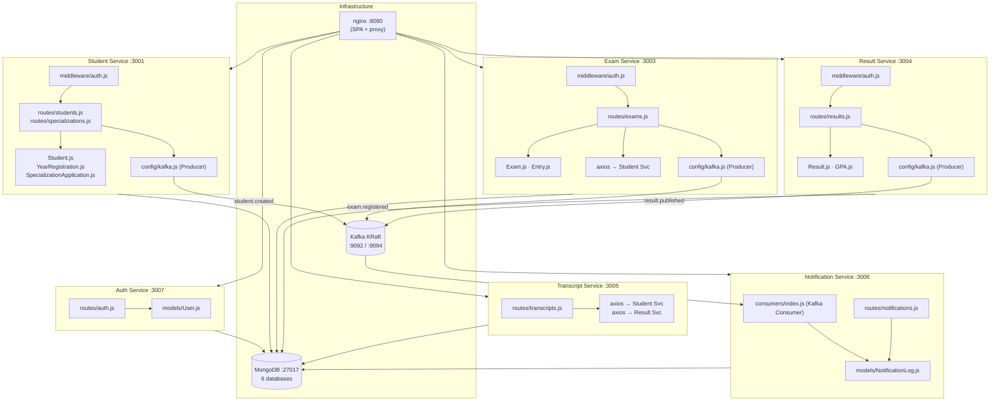

# Team Questions — Answers

Source: `supportive-docs/Team questions.docx`

---

## Q1 — Is the Result Service GET API path correct?

> *"Is the Result Service GET API in the architecture design doc supposed to be `GET /api/results/student/:studentId` instead of `GET /api/results/:studentId`?"*

**The document is already correct.**

The API Endpoint Design document already states `GET /api/results/student/:studentId`, which matches exactly what is implemented in `services/result-service/src/routes/results.js`:

```
GET /api/results                        ← query with filters (?studentId, ?semester, ?academicYear)
GET /api/results/student/:studentId     ← all results for one student, grouped by semester + GPA
```

No change needed.

---

## Q2 — Notification Service listed twice / contradiction

> *"Noticed that it says services not listed here (notification service) and has notification service again in the table — can you check if this is happening?"*

**Confirmed — there is a contradiction in the Architecture Design Document.**

The document contains this sentence (written when the prototype had only 2 services):

> *"Kafka is included in the design but not wired in the prototype — events are noted in code comments."*

The services table in the same document then lists the Notification Service fully, which contradicts the sentence above. The Notification Service is now fully implemented (Phase 3 — G11) with:
- KafkaJS consumer subscribing to `student.created`, `exam.registered`, `result.published`
- `NotificationLog` model persisting all events to `notif_db`
- REST endpoints: `GET /api/notifications`, `GET /api/notifications/student/:studentId`

**Action required:** Remove or update that sentence in `deliverable-docs/Architecture Design Document.docx` to reflect that Kafka and the Notification Service are fully built and running.

**Updated text suggestion:**
> *"Kafka is implemented using Apache Kafka 3.7 in KRaft mode (no Zookeeper). The Notification Service (port 3006) consumes three Kafka topics and persists each event as a NotificationLog record."*

---

## Q3 — Add a component-level architecture diagram

> *"What if we add a component-level architecture diagram to the Architecture Design Document?"*

**Yes — feasible and recommended.** A component diagram shows the internal structure of each service (routes, models, middleware, Kafka config) and how they connect to shared infrastructure.

Paste the Mermaid source below into [mermaid.live](https://mermaid.live), export as PNG, and insert into `deliverable-docs/Architecture Design Document.docx`.



---

## Q5 — Document role-based endpoint restrictions

> *"Don't we need to mention that certain endpoints need to be restricted by role? For example, `POST /api/exams` should be admin only."*

**Correct — this is a gap in the API Endpoint Design document.** Role restrictions are enforced in code via `req.user.role` but are not documented in the API doc. The following section should be added.

### Role Definitions

| Role | Description |
|------|-------------|
| ADMIN | Full access to all endpoints |
| EXAM_DIVISION | Manage exams, results, registrations |
| HOD | Approve/reject exam entries, read-only on all data |
| LECTURER | Approve/reject exam entries, read-only on all data |
| STUDENT | Own data only — apply for specialization, view own results and enrolment |

### Endpoint Role Restrictions

| Endpoint | Allowed Roles | Notes |
|----------|--------------|-------|
| `POST /api/students` | ADMIN, EXAM_DIVISION | Create student accounts |
| `POST /api/students/bulk` | ADMIN, EXAM_DIVISION | Bulk CSV import |
| `PATCH /api/students/:id` | ADMIN, EXAM_DIVISION (full), STUDENT (limited) | Students cannot update studentId, email, nic, district |
| `POST /api/students/:id/photo` | ADMIN, EXAM_DIVISION | Profile photo upload |
| `POST /api/students/:id/year-registration` | ADMIN, EXAM_DIVISION | Year enrolment |
| `POST /api/exams` | ADMIN, EXAM_DIVISION | Create exam |
| `PATCH /api/exams/:id/schedule` | ADMIN, EXAM_DIVISION | Set registration window |
| `PATCH /api/exams/:id/toggle` | ADMIN, EXAM_DIVISION | Open/close registration |
| `PATCH /api/exams/:id/entries/:entryId` | ADMIN, EXAM_DIVISION, HOD, LECTURER | Approve or reject entry |
| `POST /api/results` | ADMIN, EXAM_DIVISION | Upload result |
| `POST /api/results/bulk` | ADMIN, EXAM_DIVISION | Bulk result import |
| `PATCH /api/results/gpa/:id/finalize` | ADMIN, EXAM_DIVISION | Finalise GPA |
| `PATCH /api/specializations/:id/assign` | ADMIN, EXAM_DIVISION | Assign specialization |
| `GET /api/notifications` | ADMIN, EXAM_DIVISION, HOD, LECTURER | View event log |
| All `GET` endpoints (students, exams, results, transcripts) | All authenticated roles | Read access for all |

**Action required:** Add this table and the 403 status code to relevant endpoints in `deliverable-docs/API Endpoint Design.docx`.

---

## Q6 — Add a standard error response schema

> *"Should we add a standard error response schema to the API endpoint docs? Right now we mention status codes like 400 but don't show what the actual error response body looks like."*

**Yes — this should be added as a section at the top of the API Endpoint Design document**, before the per-service endpoint definitions.

### Standard Error Response

All `4xx` and `5xx` responses return a JSON body in this format:

```json
{
  "error": "Human-readable description of the problem"
}
```

For upstream failures (502), an optional `detail` field is included:

```json
{
  "error": "Student Service unavailable",
  "detail": "connect ECONNREFUSED 172.18.0.3:3001"
}
```

### Error Code Reference

| HTTP Code | Meaning | Example `error` value |
|-----------|---------|----------------------|
| `400` | Validation failed / bad input | `"name is required"` |
| `401` | Missing or invalid JWT token | `"No token provided"` / `"Invalid token"` |
| `403` | Authenticated but insufficient role | `"Forbidden"` |
| `404` | Resource not found | `"Student not found"` |
| `409` | Duplicate — unique constraint violated | `"Email or studentId already exists"` |
| `502` | Upstream service unavailable | `"Student Service unavailable"` |
| `500` | Unexpected server error | `"Internal server error"` |

**Action required:** Add this section to `deliverable-docs/API Endpoint Design.docx` — place it after the global authentication note and before Section 2 (Auth Service endpoints).

---

## Q7 — Add API Versioning / Backward Compatibility to Risks

> *"Can't we add API Versioning / Backward Compatibility under Risks and Mitigations?"*

**Yes — this is a valid and important risk that is currently missing.** Add it as Risk 7 in `deliverable-docs/Benefits and Risks.docx`.

### Risk 7 — API Versioning / Backward Compatibility

**Risk:** Consumer services (e.g., the Exam Service relying on the Student Service's API, or the Transcript, Notification, and Reporting Services consuming Kafka events) can break if a producer changes its API response structure or event payload. Because there is no compile-time type validation between services, changes such as renaming a field, removing a field, or changing a data type may only be discovered at runtime — potentially in production.

This risk is amplified in an event-driven system: a change to the `result.published` Kafka event payload could silently break the Notification Service without any immediate error being surfaced.

**Mitigation:** This is not implemented in the current prototype. In a production system the following approaches would be used:

| Mitigation | Description |
|------------|-------------|
| API versioning | Prefix all routes with `/api/v1/` — breaking changes are released under `/api/v2/` while consumers migrate |
| Kafka schema versioning | Include a `version` field in every event payload (e.g., `{ "version": 1, "studentId": "..." }`) |
| Schema Registry | Use Confluent Schema Registry with Avro or JSON Schema to enforce event contracts at publish time |
| Contract testing | Use Pact (consumer-driven contract testing) to detect breaking API changes in CI before deployment |
| Additive-only changes | Treat all API and event changes as additive (new fields only, never remove or rename) during the deprecation window |

**Action required:** Add this as Risk 7 in `deliverable-docs/Benefits and Risks.docx` and include it in the risk-benefit summary table.

---

## Document Change Summary

| Question | Document to update | Action |
|----------|--------------------|--------|
| Q2 | `deliverable-docs/Architecture Design Document.docx` | Remove/update "Kafka not wired in prototype" sentence |
| Q3 | `deliverable-docs/Architecture Design Document.docx` | Insert component diagram PNG (render Mermaid above in mermaid.live) |
| Q5 | `deliverable-docs/API Endpoint Design.docx` | Add role definitions table + endpoint role restriction table + 403 to relevant status codes |
| Q6 | `deliverable-docs/API Endpoint Design.docx` | Add standard error response schema section before Section 2 |
| Q7 | `deliverable-docs/Benefits and Risks.docx` | Add Risk 7 — API Versioning / Backward Compatibility |
